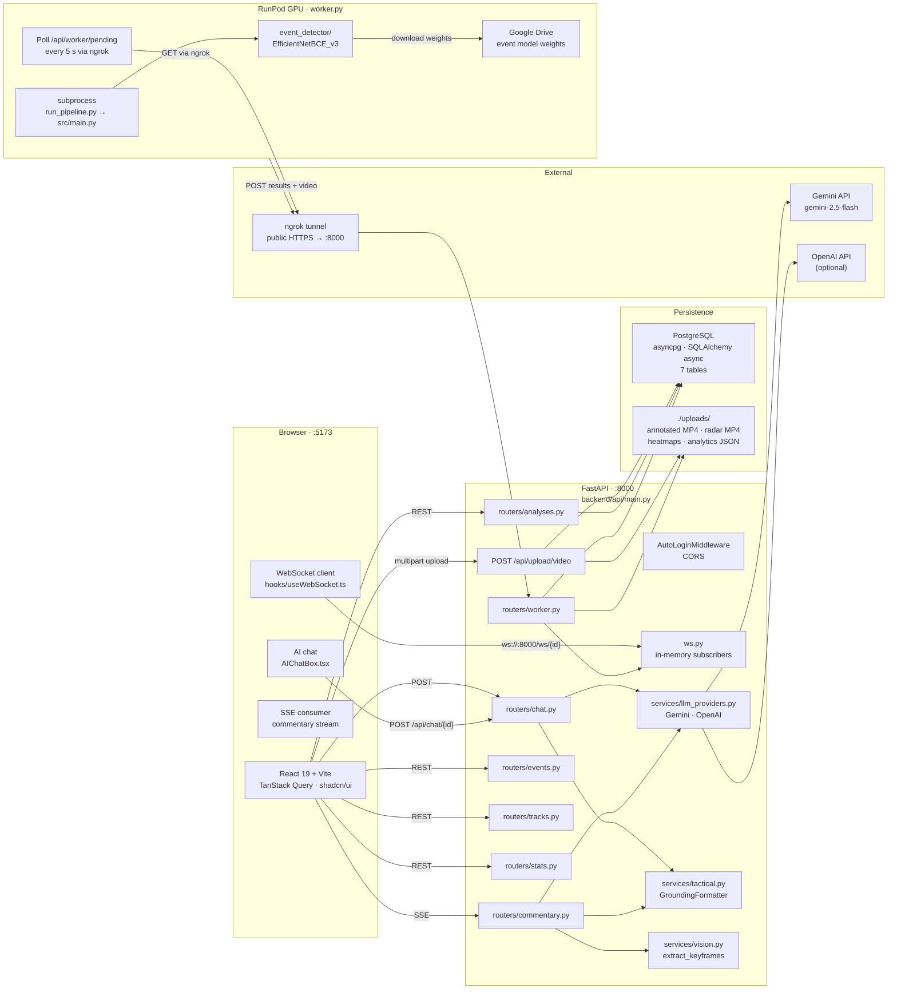
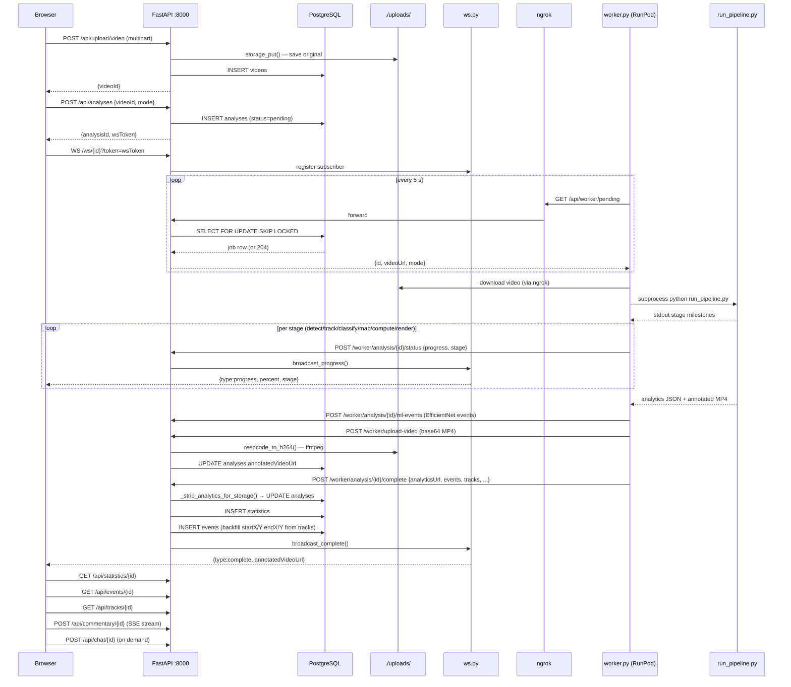
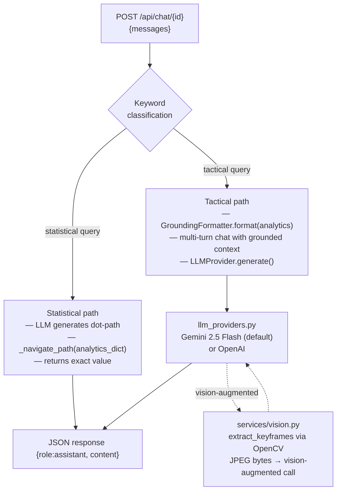

# Architecture

This document describes how the system is wired together — components, data flows, design decisions, and what would change in a production build. For setup instructions see [README.md](README.md); for evaluation methodology and model performance numbers see [EVALUATION.md](EVALUATION.md).

The system is a **dissertation proof-of-concept** (Warwick CS310, March 2026). Every architectural decision below is evaluated against that scope — short video clips, one developer, no concurrent users, no uptime requirement.

---

## 1. Component Map



---

## 2. Request Lifecycle

End-to-end trace for a single analysis job.



---

## 3. CV Pipeline Internals

The pipeline runs as a subprocess spawned by `backend/pipeline/worker.py`. Module layout under `backend/pipeline/src/`:

```
src/
├── main.py                   CLI entry; orchestrates stages
├── all.py                    Full analysis mode
├── trackers/
│   ├── detection.py          YOLOv8x inference wrapper
│   ├── people.py             ByteTrack multi-object tracker
│   ├── ball_tracker.py       8-stage filter (interp, Kalman)
│   ├── ball_dag_solver.py    Graph-based ball path repair
│   └── track_stabiliser.py  GK / referee label locking (majority voting)
├── pitch/
│   ├── view_transformer.py   Homography: keypoints → real-world metres
│   └── homography_smoother.py  Temporal smoothing
├── team_assigner/
│   └── team_assigner.py      SigLIP 768-dim embeddings → UMAP → KMeans (k=2)
└── analytics/
    ├── possession.py
    ├── events.py             Pass / shot / cross detection from tracks
    ├── kinematics.py         Speed, distance, sprint counts
    ├── ball_path.py          Pitch-coordinate trajectory
    ├── interaction_graph.py  Pass networks
    ├── expected_threat.py    xT surface from ball positions
    └── tactical.py           PPDA, compactness, defensive shape
```

See [README.md#pipeline-flow](README.md#pipeline-flow) for the stage-level Mermaid diagram.

---

## 4. ML Event Detector

`backend/event_detector/` is a **separate** sub-system from the classical CV pipeline. It runs a learned model after tracking completes and posts its results through a dedicated endpoint.

**Model**: `EfficientNetBCE_v3` (`model.py`).

**Inference** (`inference.py`, `config.py`):
- Sliding window: 1.5 s @ 25 fps = 38-frame triplets; frames converted to grayscale and ImageNet-normalised.
- Classes: background / challenge / play / throwin.
- Class weights: `(1.5, 5.0, 4.0, 4.0)` — upweighted because rare events are underrepresented.
- Thresholds (post-sweep): challenge=0.60, play=0.55, throwin=0.95.

**Postprocessing** (`postprocess.py`):
- `temporal_nms` suppresses duplicate detections within a window.
- `merge_nearby_events` collapses events closer than a gap threshold.
- `to_football_events` converts to the API event schema.

**API integration**: results POSTed to `POST /api/worker/analysis/{id}/ml-events` (tagged `§4.8 diss_4_8` in `routers/worker.py`).

Weights are downloaded from Google Drive via `gdown` at worker boot. See [EVALUATION.md](EVALUATION.md) for per-class precision/recall/F1 numbers (micro F1 0.782; challenge recall 0.286 is a model-capacity floor, not a threshold issue).

---

## 5. LLM and Chat Subsystem



**Key files**:
- `backend/api/services/llm_providers.py` — abstract `LLMProvider`; Gemini implementation (`GEMINI_API_KEY`) and OpenAI implementation (`OPENAI_API_KEY`). Vision-augmented `generate()` accepts JPEG bytes alongside text.
- `backend/api/services/tactical.py` — `GroundingFormatter` serialises the analytics JSON into a structured markdown system prompt. Contains `SYSTEM_PROMPTS` keyed by analysis type (match_overview, etc.).
- `backend/api/services/vision.py` — `extract_keyframes()` uses OpenCV to sample representative frames; feeds the vision path. Responsible for the 61.5% → 90.9% factual grounding lift cited in dissertation §4.7.
- `backend/api/routers/chat.py` — dual-path router: statistical queries use a deterministic dot-path resolver; tactical queries go through the full grounded LLM pipeline.
- `backend/api/routers/commentary.py` — SSE streaming via `POST /api/commentary/{id}/stream`; each `data: {text|done|error}` line is flushed to the browser as generated.

---

## 6. Database and Storage

### Schema (7 tables — `backend/api/models.py`)

| Table | Purpose |
|-------|---------|
| `users` | User accounts; auto-created in local dev via `AutoLoginMiddleware` |
| `videos` | Uploaded video metadata (path, filename, size, duration) |
| `analyses` | Pipeline jobs — `status`, `progress`, `currentStage`, `claimedBy`, `annotatedVideoUrl`, `analyticsDataUrl` |
| `events` | Detected match events — type, frame, timestamp, team, player IDs, `startX/Y`, `endX/Y` |
| `tracks` | Per-frame tracking data — `playerPositions`, `ballPosition`, formation snapshot (JSON columns) |
| `statistics` | Aggregated match stats — possession, pass counts, speeds, heatmap grids, pass network edge list |
| `commentary` | AI-generated tactical analysis segments |

Tables are created with `CREATE TABLE IF NOT EXISTS` on first FastAPI startup (no Alembic migration in this codebase).

### Notable implementation details

- `event_metadata = mapped_column("metadata", ...)` in `models.py` — SQLAlchemy reserves the name `metadata` on `DeclarativeBase`; the column is aliased.
- `_strip_analytics_for_storage()` in `routers/worker.py` strips per-frame arrays from the analytics payload before writing it to the `analyses` row. Raw analytics can exceed Postgres's practical TEXT size budget.
- `float('inf')` and `float('nan')` values produced by the pipeline are sanitised with `math.isfinite()` checks in both the serialiser and the worker before any JSON encoding.
- Pipeline output uses the `mp4v` codec, which browsers cannot play. `storage.reencode_to_h264()` calls ffmpeg to transcode to H.264 before saving to `./uploads/`.

### File storage

Artefacts are written to `./uploads/` (local filesystem) and served as FastAPI static files at `/uploads`. No CDN, no object store. Path: `backend/api/storage.py`.

---

## 7. Worker Coordination Protocol

The worker is **not** a message-queue consumer — it is a polling HTTP client that treats the PostgreSQL `analyses` table as a queue.

**Atomic claim** (`backend/api/routers/worker.py:41`):

```sql
SELECT * FROM analyses
WHERE status = 'pending'
FOR UPDATE SKIP LOCKED
LIMIT 1
```

This prevents two workers claiming the same job. The row is immediately updated to `status='processing'` with a `claimedBy` identifier.

**Stale-claim recovery**: any row with `status='processing'` and `updatedAt` older than `PROCESSING_LEASE_TIMEOUT` (15 minutes) is re-offered by `/worker/pending`. This handles crashed workers.

**Auth**: `X-Worker-Key` header verified by `verify_worker_key` in `routers/worker.py`. Bypassed when `LOCAL_DEV_MODE=true`.

**Progress weighting** (`pipeline/worker.py`):

| Stage | Weight |
|-------|--------|
| detect | 30% |
| track | 20% |
| classify | 15% |
| map | 10% |
| compute | 10% |
| render | 15% |

Stage names are matched from subprocess stdout. `PIPELINE_SUBPROCESS=1` env var makes the pipeline skip TTY detection so stdout flushes reliably.

**Completion**: `POST /worker/analysis/{id}/complete` is retried up to `COMPLETE_RETRIES=3` times with exponential back-off.

---

## 8. Topology: Local Dev vs. RunPod

### Local dev

```
localhost:5173  (Vite dev server)
    ↕  /api, /uploads, /ws proxied (vite.config.ts)
localhost:8000  (FastAPI + uvicorn)
    ↕  postgresql+asyncpg://
localhost:5432  (PostgreSQL)
```

`AutoLoginMiddleware` creates a dev user on every request so no login is needed.

### With RunPod worker

```
localhost:8000  ←── ngrok ──→  https://xxx.ngrok-free.dev
                                        ↑
                               worker.py (RunPod GPU)
                               DASHBOARD_URL=https://xxx.ngrok-free.dev
```

The worker cannot reach `localhost:8000` — ngrok punches a public HTTPS tunnel into the developer's laptop. The ngrok free tier gives a stable hostname but rate-limits to ~40 req/min, which is sufficient for one worker polling every 5 s and uploading one video at a time.

The dissertation used a **RunPod RTX 6000 Ada 48 GB** ($0.74/hr, on-demand). The `restart_worker.sh` launch script is at `/workspace/restart_worker.sh` on the pod.

---

## 9. Design Reflection

These are the trade-offs that made sense for a dissertation proof-of-concept, and the seams where a production build would diverge.

### Per-frame tracks in Postgres JSON columns

**Current**: `tracks` table stores one row per frame with `playerPositions` and `ballPosition` as JSON. At 25 fps a 30 s clip is 750 rows. A 90-minute match would be 135,000 rows with dense payloads — Postgres handles this, but query patterns (range scans by frame, aggregations over time) are awkward against unindexed JSON.

**What tracking data actually is**: a time series. Every row is a measurement at a known timestamp. The natural fit is a time-series store: **TimescaleDB** (Postgres extension, so minimal migration effort), **InfluxDB**, or columnar storage — Parquet files on S3/R2 queried via DuckDB or ClickHouse. A hypertable partitioned by frame_number would give efficient range queries and automatic compression.

**Why the current choice was acceptable**: the dissertation only processes short clips (30–90 s), analyses are numbered in the tens, and keeping the stack to one database (Postgres) reduced operational complexity.

### Polling-based job queue

**Current**: `worker.py` polls `GET /api/worker/pending` every 5 s. The claim mechanism is re-implemented in SQL (`FOR UPDATE SKIP LOCKED`, lease timeouts, retry logic). This is ~80 lines of coordination code that any queue provides for free.

**Production alternative**: SQS, Redis Streams, NATS JetStream, or RabbitMQ. A message becomes visible when the worker fails to ACK within the visibility timeout — no manual lease tracking needed. Dead-letter queues catch poison messages automatically.

**Why acceptable**: polling over ngrok is simple and inspectable (`tail -f worker.log` shows every claim). A queue would require another service in the local dev stack.

### Local disk for artefacts

**Current**: annotated videos, radar videos, and analytics JSON live in `./uploads/`. FastAPI mounts it as a static directory. Video URLs in the database are relative paths.

**Production alternative**: S3 / Cloudflare R2 / GCS with pre-signed URLs and a CDN in front. Absolute URLs in the database. The `storage.py` abstraction layer (`storage_put`, `storage_get`) already exists — swapping the backend would be localised.

**Why acceptable**: self-contained, zero egress cost during iterative development.

### ngrok as ingress

**Current**: `ngrok http 8000` gives a public HTTPS URL. `X-Worker-Key` is a static shared secret in `.env`. The free tier hostname is stable but rate-limited and shared with other ngrok users on the same TLS certificate pool.

**Production alternative**: Cloudflare Tunnel (zero-trust), Tailscale (private overlay network), or place the worker inside the same VPC as the API server. Worker authentication should use short-lived JWTs, not a static key. The API should validate the worker's claimed GPU identity.

**Why acceptable**: one developer, zero concurrent users, the tunnel is only open when actively testing.

### In-memory WebSocket subscriber registry

**Current**: `backend/api/ws.py` stores subscribers in a module-level Python dict. Any horizontal scale-out (multiple uvicorn processes or Gunicorn workers) means a WebSocket subscriber on process A will not receive a broadcast triggered by a write on process B.

**Production alternative**: Redis pub/sub or Postgres `LISTEN / NOTIFY` behind the broadcaster. Or a managed WebSocket service (Ably, Pusher, Soketi). The `broadcast_*` functions in `ws.py` are the only callers — the interface is narrow enough to swap.

**Why acceptable**: single uvicorn process, single developer.

### Auto-login middleware

**Current**: `AutoLoginMiddleware` (`backend/api/auth.py`) creates or retrieves a dev user on every unauthenticated request. This is intentional ergonomics — no login friction during development.

**Production alternative**: OAuth 2.0 (Google, GitHub) or email/password with JWT session tokens. Worker authentication upgraded from `X-Worker-Key` to per-job signed tokens so a compromised worker cannot query arbitrary analyses.

### LLM grounding context per chat turn

**Current**: every chat turn calls `GroundingFormatter.format(analytics_data)` and sends the full markdown blob as a system prompt. For a large analytics object this is hundreds of tokens per turn — no caching.

**Production alternative**: Anthropic prompt caching or Gemini context caching pins the system prompt across turns. An analytics-hash-keyed response cache (Redis + TTL) would serve repeated identical queries instantly. Retrieval-augmented generation (chunked analytics indexed in a vector store) would handle the "full 90 min match" scale problem.

### Model weights downloaded at boot

**Current**: `worker.py` downloads ~400 MB of YOLOv8 weights from a CDN and event-detector weights from Google Drive on first start. Subsequent starts use the local `pipeline/models/` cache.

**Production alternative**: bake weights into the Docker image (`docker/Dockerfile.worker` exists but is not the standard launch path). An autoscaling GPU fleet cannot afford a cold-start penalty on every pod.

### Subprocess stdout parsing for progress

**Current**: `_LogProgress` in `pipeline/worker.py` reads pipeline stdout and matches stage names (e.g. `"detecting"`) to derive progress percentage. This couples the worker to the pipeline's log format.

**Production alternative**: structured progress events — JSON lines on stdout, or a lightweight HTTP callback from the pipeline to the worker, or a shared memory counter.

---

## 10. File Index

| If you want to understand... | Read |
|------------------------------|------|
| FastAPI app composition, middleware, static mounts | `backend/api/main.py` |
| Worker claim protocol, completion handler, strip logic | `backend/api/routers/worker.py` |
| AI chat dual-path (statistical vs. tactical) | `backend/api/routers/chat.py` |
| LLM provider abstraction (Gemini, OpenAI, vision) | `backend/api/services/llm_providers.py` |
| Analytics grounding formatter, system prompts | `backend/api/services/tactical.py` |
| Keyframe extraction for vision augmentation | `backend/api/services/vision.py` |
| Database models (7 tables, type annotations) | `backend/api/models.py` |
| WebSocket subscriber registry and broadcast | `backend/api/ws.py` |
| File storage, H.264 re-encode | `backend/api/storage.py` |
| GPU worker polling loop, subprocess orchestration | `backend/pipeline/worker.py` |
| Pipeline CLI entry, stage ordering | `backend/pipeline/src/main.py` |
| Analytics computation (all modules) | `backend/pipeline/src/analytics/` |
| ML event detector inference + postprocessing | `backend/event_detector/inference.py`, `postprocess.py` |
| Frontend REST client (all API calls) | `frontend/src/lib/api-local.ts` |
| WebSocket hook (reconnect, message dispatch) | `frontend/src/hooks/useWebSocket.ts` |
| Vite proxy config (/api, /uploads, /ws) | `frontend/vite.config.ts` |
| Event detector evaluation (F1, thresholds) | `EVALUATION.md` |
| LLM grounding rate results, ablation | `dissertation/findings/FINDINGS.md` |
